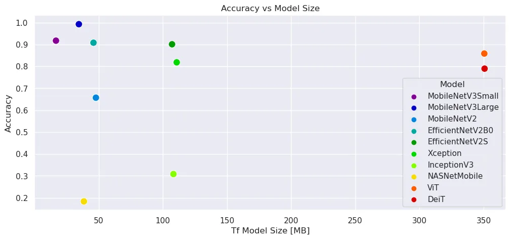

# Tf Image Classifier

## Model Training

* [Evaluation Overview](/notebooks/)
  * [EfficientNetV2B0]()
  * [EfficientNetV2S]()
  * [Xception]()
  * [InceptionV3]()
  * [NASNetMobile]()
  * [MobileNetV3Small]()
  * [MobileNetV3Large]()
  * [MobileNetV2]()
  * [vit-base-patch16-224]()
  * [DeiT]()





### Docker Setup

```bash
docker pull tensorflow/tensorflow:latest-gpu-jupyter
```

All notebooks mounted into `/tf/notebooks` will be accessible from the served Jupyter Notebook. After running the command you can access the Jupyter UI on `localhost:8888`:

```bash
docker run --gpus all --rm -p 8888:8888 --name tf-notebook \
--mount type=bind,source=$(pwd),target=/tf/notebooks \
tensorflow/tensorflow:latest-gpu-jupyter
```

```bash
To access the notebook, open this file in a browser:
        file:///root/.local/share/jupyter/runtime/nbserver-1-open.html
    Or copy and paste one of these URLs:
        http://b62cc9c31655:8888/?token=484cd6b995e8dc53f878795f00a83015c74410771882141c
     or http://127.0.0.1:8888/?token=484cd6b995e8dc53f878795f00a83015c74410771882141c
```


## Model Serving

I am going to use the official Tensorflow `tensorflow-serving` Docker container to deploy the model:

* [Tensorflow Docker Model Server](https://mpolinowski.github.io/docs/IoT-and-Machine-Learning/AIOps/2023-01-01-tf-model-server/2023-01-01/)


Simply point the source directory to the model save path that you want to use, e.g. `Efficientv2B0`:


```bash
docker run --gpus all -p 8501:8501 --name tf-serve \
--mount type=bind,source=$(pwd)/saved_model,target=/models \
-e MODEL_NAME=efficientv2b0_model -t tensorflow/serving:latest-gpu
```


### Inference Server

#### REST API

For testing I will just start a simple python container and install my dependencies manually:

```bash
docker run --rm -ti --network host \
--mount type=bind,source=$(pwd)/api_request,target=/opt/app \
python:alpine /bin/ash
```


```bash
pip install pillow requests numpy
```

Executing the API request script `/opt/app/api_request/rest_request.py` inside the container will send 1 of 3 test images to the Tensorflow model API to retrieve a prediction:


```bash
python /opt/app/rest_request.py

Class probabilities:  [[2.02370361e-13 5.45808624e-12 3.14568647e-17 4.50543422e-11
  1.74268600e-09 2.22335952e-12 5.15965439e-12 2.28333991e-10
  3.17855503e-18 3.61456546e-12 1.40493947e-17 1.46841839e-09
  3.42843321e-13 2.59899831e-16 2.68869540e-12 1.53930095e-08
  1.36200578e-12 6.06594810e-16 2.21194929e-14 5.79839779e-17
  1.05216942e-12 6.55278443e-10 2.30210545e-13 6.22206000e-15
  5.16498033e-16 1.86334712e-15 7.34451477e-09 9.92521278e-13
  1.40660292e-08 5.47506651e-10 3.36575397e-16 1.56563315e-12
  4.54165000e-09 4.07618221e-13 1.69515952e-05 1.08003778e-05
  2.42027980e-08 1.65058089e-09 1.25125591e-13 4.95898966e-09
  1.62804418e-16 5.25978046e-17 1.91704139e-14 2.93358880e-18
  3.04848768e-08 1.63559369e-14 9.99972224e-01 2.25344784e-10]]

Predicted class:  Viola
```


## Serving Multiple Models

Ok, with this working I want to configure the Model Server to serve all the trained models.


```bash
tree -L 2 saved_model

saved_model
├── deit_model
│   └── 1
├── efficients_model
│   └── 1
├── efficientv2b0_model
│   └── 1
├── inception_model_model_ft
│   └── 1
├── mobilenet2_model_ft
│   └── 1
├── mobilenetv3L_model_ft
│   └── 1
├── mobilenetv3S_model
│   └── 1
├── nasnetmobile_model_ft
│   └── 1
├── vit_model
│   └── 1
└── xception_model
    └── 1
```

For this we have to add a [models.config](https://www.tensorflow.org/tfx/serving/serving_config) file inside the `models` container. The configuration file can then be added by adding the following flags (the automatic reload is optional):


```bash
docker run -t --rm -p 8501:8501 --name tf-serve \
    --mount type=bind,source=$(pwd)/saved_model,target=/models \
    tensorflow/serving:latest-gpu \
    --model_config_file=/models/models.config \
    --model_config_file_poll_wait_seconds=60
```


_./saved\_model/models.config_


```bash
model_config_list {
  config {
    name: 'efficientv2b0_model'
    base_path: '/models/efficientv2b0_model/'
    model_platform: 'tensorflow'
    model_version_policy {
    specific {
      versions: 1
      }
    }
  }
  config {
    name: 'mobilenetv3S_model'
    base_path: '/models/mobilenetv3S_model/'
    model_platform: 'tensorflow'
    model_version_policy {
    specific {
      versions: 1
      }
    }
  }
  config {
    name: 'vit_model'
    base_path: '/models/vit_model/'
    model_platform: 'tensorflow'
    model_version_policy {
    specific {
      versions: 1
      }
    }
  }
}
```

Starting up the container I can now see that Tensorflow is reloading all three models in a 60s interval:


```bash
tensorflow_serving/model_servers/server.cc:430] Exporting HTTP/REST API at:localhost:8501 ...
tensorflow_serving/model_servers/server_core.cc:465] Adding/updating models.
tensorflow_serving/model_servers/server_core.cc:594]  (Re-)adding model: efficientv2b0_model
tensorflow_serving/model_servers/server_core.cc:594]  (Re-)adding model: mobilenetv3S_model
tensorflow_serving/model_servers/server_core.cc:594]  (Re-)adding model: vit_model
tensorflow_serving/model_servers/server_core.cc:486] Finished adding/updating models
```


I now added the URL for all three models to the Python request script:


```python
url1 = 'http://localhost:8501/v1/models/efficientv2b0_model:predict'
url2 = 'http://localhost:8501/v1/models/mobilenetv3S_model:predict'
url3 = 'http://localhost:8501/v1/models/vit_model:predict'
```


That will now return 3 predictions:


```bash
python /opt/app/rest_request.py
Prediction Results: EfficientV2B0
Class probabilities:  [[1.27231669e-18 7.36642785e-15 2.12142088e-16 8.37840160e-13
  2.54633266e-15 2.23082670e-22 1.22582740e-17 1.58766519e-16
  3.15969443e-21 3.40760905e-12 9.31879706e-21 1.35364190e-16
  4.19998346e-13 6.28031038e-19 1.42876893e-08 1.52733778e-16
  1.71126649e-18 6.26449727e-18 1.70084369e-22 5.93363685e-27
  1.35457736e-23 9.82926604e-26 1.07540425e-15 1.03456081e-16
  5.33486490e-14 1.70107328e-19 1.25875951e-20 1.54503871e-19
  2.05770212e-19 9.31224634e-16 2.43002143e-25 1.00000000e+00
  1.49300737e-20 6.64273082e-17 4.00534170e-18 3.18333764e-19
  1.38794318e-24 5.08237766e-13 4.06667683e-19 4.50689589e-13
  4.09000394e-16 6.34139226e-13 2.21711468e-24 3.38089155e-23
  1.83935487e-19 3.32891393e-19 1.46283768e-16 3.42905371e-23]]
Predicted class:  Nymphaea_Tetragona
Certainty:  100.0 %
Prediction Results: MobileNetV3S
Class probabilities:  [[6.27168000e-08 9.36711274e-07 3.32008640e-05 1.82103206e-04
  3.65090000e-05 7.08905601e-10 5.29715000e-09 2.18803660e-08
  1.43549421e-08 2.40992620e-07 2.09935107e-12 9.32755886e-11
  1.55253754e-10 2.58531685e-08 1.72480277e-03 9.44796508e-09
  1.51912500e-12 3.97989908e-07 4.73708963e-13 2.97169041e-14
  4.57825137e-14 4.23965169e-11 4.12751433e-07 1.92947700e-05
  8.95965513e-06 5.97457550e-09 4.81428591e-13 3.20082150e-13
  1.89814697e-09 9.56469748e-09 3.24247695e-09 9.97930884e-01
  9.90472593e-09 2.25990516e-06 2.97242941e-09 4.48806965e-08
  8.23452157e-12 5.94276535e-05 3.16433564e-08 3.98971480e-07
  2.16912586e-08 8.35711322e-09 1.56445000e-12 1.42842169e-10
  2.86222768e-10 7.43138450e-12 1.27389072e-10 1.44366144e-10]]
Predicted class:  Nymphaea_Tetragona
Certainty:  99.793 %
Prediction Results: ViT
Class probabilities:  [[2.62611400e-04 9.45560227e-04 7.97024090e-03 2.50866893e-03
  5.62246714e-04 9.96018527e-04 5.78884617e-04 1.15711347e-03
  1.87621685e-03 2.56323745e-03 1.19275635e-03 5.13695000e-04
  8.98167782e-04 4.11458139e-04 1.77495480e-02 3.71844682e-04
  3.45975481e-04 1.64183730e-04 1.62366749e-04 4.10321372e-04
  5.85561967e-04 4.59756848e-04 7.18721712e-04 2.03839969e-03
  2.18398985e-03 8.30425473e-04 5.62683621e-04 1.05744123e-03
  1.08664425e-03 8.36106890e-04 4.69557708e-04 9.25359428e-01
  7.82242860e-04 8.19175097e-04 4.58333000e-04 2.90713477e-04
  2.36424108e-04 8.55224300e-03 6.25506684e-04 9.37757781e-04
  5.16826578e-04 4.17304225e-03 5.67917000e-04 4.71120235e-04
  7.65961187e-04 7.77638000e-04 1.47661043e-03 7.18727824e-04]]
Predicted class:  Nymphaea_Tetragona
Certainty:  92.536 %
```