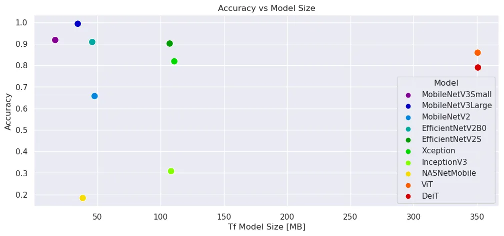
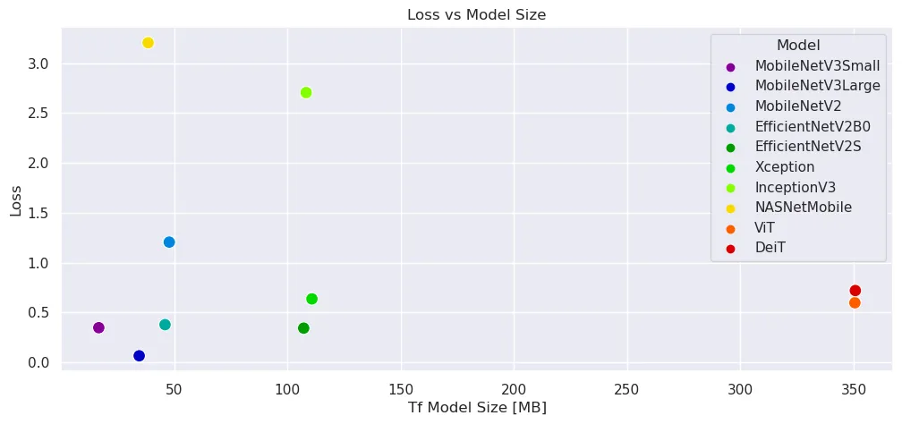
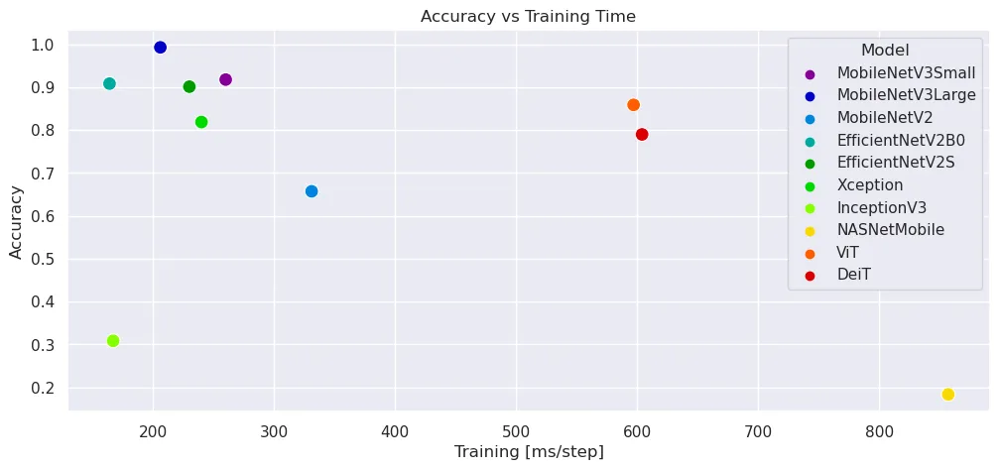
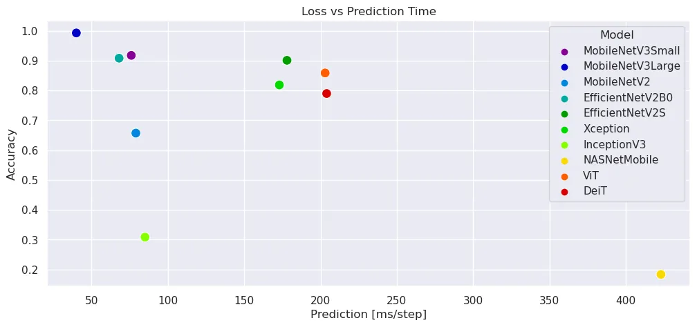
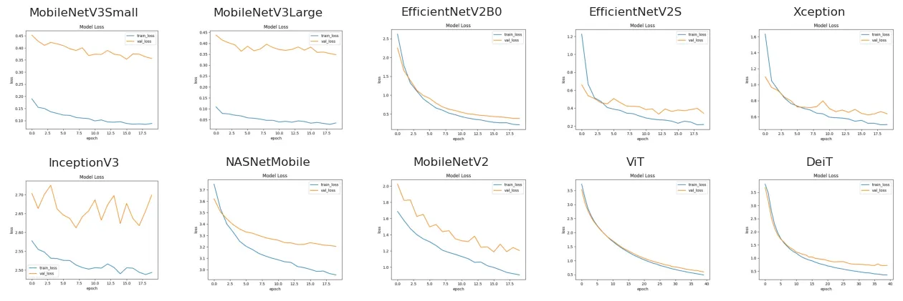
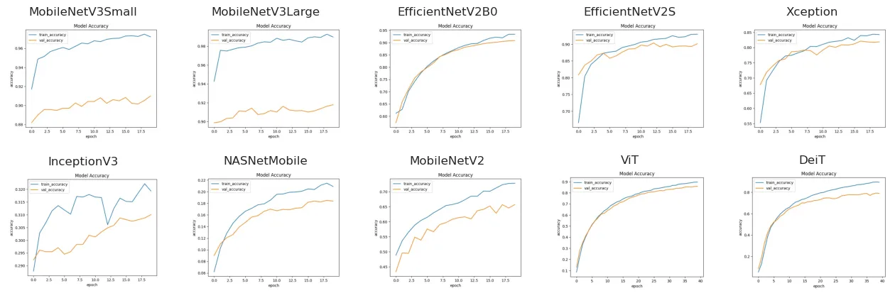
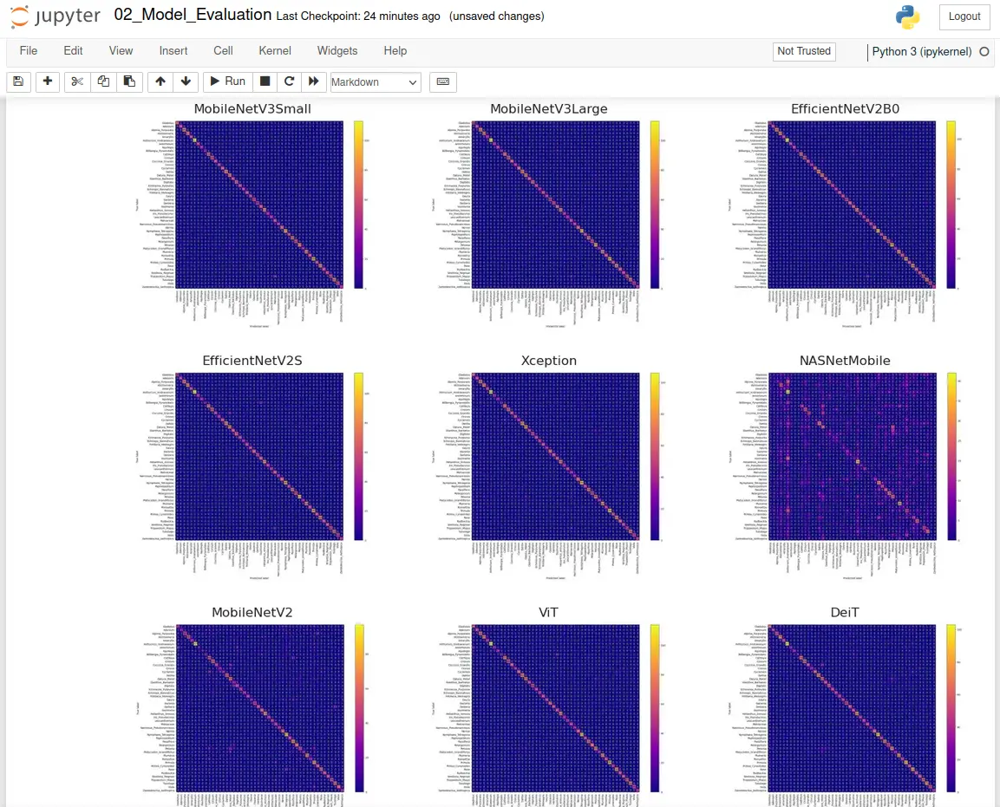

# Tf Image Classifier

## Model Evaluation

<!-- #region -->
[Keras Applications](https://keras.io/api/applications/) are deep learning models that are made available alongside pre-trained weights. These models can be used for prediction, feature extraction, and fine-tuning.

Weights are downloaded automatically when instantiating a model. They are stored at `~/.keras/models/`:


### Available Models - Excerp

| Model | Size (MB) | Top-1 Accuracy | Top-5 Accuracy | Parameters | Depth | Time (ms) per inference step (CPU) | Time (ms) per inference step (GPU) |
| -- | -- | -- | -- | -- | -- | -- | -- |
| Xception | 88 | 79.0% | 94.5% | 22.9M | 81 | 109.4 | 8.1 |
| ResNet50V2 | 98 | 76.0% | 93.0% | 25.6M | 103 | 45.6 | 4.4 |
| InceptionV3 | 92 | 77.9% | 93.7% | 23.9M | 189 | 42.2 | 6.9 |
| MobileNet | 16 | 70.4% | 89.5% | 4.3M | 55 | 22.6 | 3.4 |
| MobileNetV2 | 14 | 71.3% | 90.1% | 3.5M | 105 | 25.9 | 3.8 |
| NASNetMobile | 23 | 74.4% | 91.9% | 5.3M | 389 | 27.0 | 6.7 |
| EfficientNetV2B0 | 29 | 78.7% | 94.3% | 7.2M | - | - | - |
| EfficientNetV2B1 | 34 | 79.8% | 95.0% | 8.2M | - | - | - |
| EfficientNetV2B2 | 42 | 80.5% | 95.1% | 10.2M | - | - | - |
| EfficientNetV2B3 | 59 | 82.0% | 95.8% | 14.5M | - | - | - |
| EfficientNetV2S | 88 | 83.9% | 96.7% | 21.6M | - | - | - |
| EfficientNetV2M | 220 | 85.3% | 97.4% | 54.4M | - | - | - |
| EfficientNetV2L | 479 | 85.7% | 97.5% | 119.0M | - | - | - |
<!-- #endregion -->

### Used Models

* EfficientNetV2B0
* EfficientNetV2S
* Xception
* InceptionV3
* NASNetMobile
* MobileNetV3Small
* MobileNetV3Large
* MobileNetV2
* vit-base-patch16-224
* DeiT

```python
import matplotlib.pyplot as plt
import pandas as pd
import seaborn as sns
```

## Model Metrics

```python
model_metrics = [
    [ 'MobileNetV3Small', 0.3474, 0.9178, 16.753, 75, 260, 7, 76 ],
    [ 'MobileNetV3Large', 0.0658, 0.9930, 34.593, 58, 206, 5, 40 ],
    [ 'MobileNetV2', 1.2054, 0.6573, 47.857, 96, 331, 8, 79 ],
    [ 'EfficientNetV2B0', 0.3779, 0.9084, 45.989, 47, 164, 8, 68 ],
    [ 'EfficientNetV2S', 0.3431, 0.9013, 107.201, 66, 230, 21, 178 ],
    [ 'Xception', 0.6363, 0.8188, 110.849, 69, 240, 18, 173 ],
    [ 'InceptionV3', 2.7047, 0.3087, 116.969, 48, 167, 10, 85 ],
    [ 'NASNetMobile', 3.2046, 0.1838, 38.513, 247, 857, 41, 423 ],
    [ 'ViT', 0.5979, 0.8589, 350.537, 172, 597, 21, 203 ],
    [ 'DeiT', 0.7199, 0.7900, 350.737, 174, 604, 21, 204 ]
]

data_columns = [
    'Model',
    'Loss',
    'Accuracy',
    'Tf Model Size [MB]',
    'Training Training Set [s]',
    'Training [ms/step]',
    'Prediction Validation Set [s]',
    'Prediction [ms/step]'
]
model_metrics_df = pd.DataFrame(model_metrics, columns=data_columns)
model_metrics_df = model_metrics_df.set_index('Model')


model_metrics_df
```

| Model | Loss | Accuracy | Tf Model Size [MB] | Training Training Set [s] | Training [ms/step] | Prediction Validation Set [s] | Prediction [ms/step] |
| -- | -- | -- | -- | -- | -- | -- | -- |
| MobileNetV3Small | 0.3474 | 0.9178 | 16.753 | 75 | 260 | 7 | 76 |
| MobileNetV3Large | 0.0658 | 0.9930 | 34.593 | 58 | 206 | 5 | 40 |
| MobileNetV2 | 1.2054 | 0.6573 | 47.857 | 96 | 331 | 8 | 79 |
| EfficientNetV2B0 | 0.3779 | 0.9084 | 45.989 | 47 | 164 | 8 | 68 |
| EfficientNetV2S | 0.3431 | 0.9013 | 107.201 | 66 | 230 | 21 | 178 |
| Xception | 0.6363 | 0.8188 | 110.849 | 69 | 240 | 18 | 173 |
| InceptionV3 | 2.7047 | 0.3087 | 116.969 | 48 | 167 | 10 | 85 |
| NASNetMobile | 3.2046 | 0.1838 | 38.513 | 247 | 857 | 41 | 423 |
| ViT | 0.5979 | 0.8589 | 350.537 | 172 | 597 | 21 | 203 |
| DeiT | 0.7199 | 0.7900 | 350.737 | 174 | 604 | 21 | 204 |

```python
plt.figure(figsize=(12, 5))

sns.set(style='darkgrid')

sns.scatterplot(
    x='Tf Model Size [MB]',
    y='Accuracy',
    data=model_metrics_df,
    s=100,
    alpha=1,
    hue='Model',
    palette='nipy_spectral'
).set_title('Accuracy vs Model Size')

plt.savefig('./assets/Model_Eval_04.webp', bbox_inches='tight')
```



```python
plt.figure(figsize=(12, 5))

sns.set(style='darkgrid')

sns.scatterplot(
    x='Tf Model Size [MB]',
    y='Loss',
    data=model_metrics_df,
    s=100,
    alpha=1,
    hue='Model',
    palette='nipy_spectral'
).set_title('Loss vs Model Size')

plt.savefig('./assets/Model_Eval_05.webp', bbox_inches='tight')
```



```python
plt.figure(figsize=(12, 5))

sns.set(style='darkgrid')

sns.scatterplot(
    x='Training [ms/step]',
    y='Accuracy',
    data=model_metrics_df,
    s=100,
    alpha=1,
    hue='Model',
    palette='nipy_spectral'
).set_title('Accuracy vs Training Time')

plt.savefig('./assets/Model_Eval_06.webp', bbox_inches='tight')
```



```python
plt.figure(figsize=(12, 5))

sns.set(style='darkgrid')

sns.scatterplot(
    x='Prediction [ms/step]',
    y='Accuracy',
    data=model_metrics_df,
    s=100,
    alpha=1,
    hue='Model',
    palette='nipy_spectral'
).set_title('Loss vs Prediction Time')

plt.savefig('./assets/Model_Eval_07.webp', bbox_inches='tight')
```




### Loss Curves

```python
loss_curves = [
    [ 'MobileNetV3Small', './assets/MobileNetV3Small_FT_01.webp' ],
    [ 'MobileNetV3Large', './assets/MobileNetV3Large_FT_01.webp' ],
    [ 'EfficientNetV2B0', './assets/EfficientNetV2B0_01.webp' ],
    [ 'EfficientNetV2S', './assets/EfficientNetV2S_01.webp' ],
    [ 'Xception', './assets/Xception_01.webp' ],
    [ 'InceptionV3', './assets/InceptionV3_FT_01.webp' ],
    [ 'NASNetMobile', './assets/NASNetMobile_FT_01.webp' ],
    [ 'MobileNetV2', './assets/MobileNetV2_FT_01.webp' ],
    [ 'ViT', './assets/ViT_01.webp' ],
    [ 'DeiT', './assets/DeiT_01.webp' ]
]
```

```python
plt.figure(figsize=(16,5))

for model, curve in loss_curves:
    for i in range(len(loss_curves)):
        ax = plt.subplot(2,5,i+1)
        plt.title(loss_curves[i][0])
        image = plt.imread(loss_curves[i][1])
        plt.imshow(image)
        plt.axis('off')
        
plt.savefig('./assets/Model_Eval_01.webp', bbox_inches='tight')
```




### Accuracy Curves

```python
accuracy_curves = [
    [ 'MobileNetV3Small', './assets/MobileNetV3Small_FT_02.webp' ],
    [ 'MobileNetV3Large', './assets/MobileNetV3Large_FT_02.webp' ],
    [ 'EfficientNetV2B0', './assets/EfficientNetV2B0_02.webp' ],
    [ 'EfficientNetV2S', './assets/EfficientNetV2S_02.webp' ],
    [ 'Xception', './assets/Xception_02.webp' ],
    [ 'InceptionV3', './assets/InceptionV3_FT_02.webp' ],
    [ 'NASNetMobile', './assets/NASNetMobile_FT_02.webp' ],
    [ 'MobileNetV2', './assets/MobileNetV2_FT_02.webp' ],
    [ 'ViT', './assets/ViT_02.webp' ],
    [ 'DeiT', './assets/DeiT_02.webp' ]
]
```

```python
plt.figure(figsize=(16,5))

for model, curve in accuracy_curves:
    for i in range(len(accuracy_curves)):
        ax = plt.subplot(2,5,i+1)
        plt.title(accuracy_curves[i][0])
        image = plt.imread(accuracy_curves[i][1])
        plt.imshow(image)
        plt.axis('off')
        
plt.savefig('./assets/Model_Eval_02.webp', bbox_inches='tight')
```




### Confusion

```python
confusion_matrices = [
    [ 'MobileNetV3Small', './assets/MobileNetV3Small_FT_04.webp' ],
    [ 'MobileNetV3Large', './assets/MobileNetV3Large_FT_04.webp' ],
    [ 'EfficientNetV2B0', './assets/EfficientNetV2B0_04.webp' ],
    [ 'EfficientNetV2S', './assets/EfficientNetV2S_04.webp' ],
    [ 'Xception', './assets/Xception_FT_04.webp' ],
    [ 'NASNetMobile', './assets/NASNetMobile_FT_04.webp' ],
    [ 'MobileNetV2', './assets/MobileNetV2_FT_04.webp' ],
    [ 'ViT', './assets/ViT_04.webp' ],
    [ 'DeiT', './assets/DeiT_04.webp' ]
]
```

```python
plt.figure(figsize=(14,12))

for model, curve in confusion_matrices:
    for i in range(len(confusion_matrices)):
        ax = plt.subplot(3,3,i+1)
        plt.title(confusion_matrices[i][0])
        image = plt.imread(confusion_matrices[i][1])
        plt.imshow(image)
        plt.axis('off')
        
plt.savefig('./assets/Model_Eval_03.webp', bbox_inches='tight')
```




## Model Prediction

### MobileNetV3Small

```python
MobileNetV3Small_Predictions = [
    [ './assets/MobileNetV3Small_Prediction_01.webp' ],
    [ './assets/MobileNetV3Small_Prediction_02.webp' ],
    [ './assets/MobileNetV3Small_Prediction_03.webp' ]
]
```

```python
plt.figure(figsize=(16,8))

for prediction in MobileNetV3Small_Predictions:
    for i in range(len(MobileNetV3Small_Predictions)):
        ax = plt.subplot(1,3,i+1)
        image = plt.imread(MobileNetV3Small_Predictions[i][0])
        plt.imshow(image)
        plt.axis('off')
        
plt.savefig('./assets/Model_Eval_MobileNetV3Small_01.webp', bbox_inches='tight')
```


### MobileNetV2

```python
MobileNetV2_Predictions = [
    [ './assets/MobileNetV2_Prediction_01.webp' ],
    [ './assets/MobileNetV2_Prediction_02.webp' ],
    [ './assets/MobileNetV2_Prediction_03.webp' ]
]
```

```python
plt.figure(figsize=(16,8))

for prediction in MobileNetV2_Predictions:
    for i in range(len(MobileNetV2_Predictions)):
        ax = plt.subplot(1,3,i+1)
        image = plt.imread(MobileNetV2_Predictions[i][0])
        plt.imshow(image)
        plt.axis('off')
        
plt.savefig('./assets/Model_Eval_MobileNetV2_01.webp', bbox_inches='tight')
```


### MobileNetV3Large

```python
MobileNetV3Large_Predictions = [
    [ './assets/MobileNetV3Large_Prediction_01.webp' ],
    [ './assets/MobileNetV3Large_Prediction_02.webp' ],
    [ './assets/MobileNetV3Large_Prediction_03.webp' ]
]
```

```python
plt.figure(figsize=(16,8))

for prediction in MobileNetV3Small_Predictions:
    for i in range(len(MobileNetV3Small_Predictions)):
        ax = plt.subplot(1,3,i+1)
        image = plt.imread(MobileNetV3Small_Predictions[i][0])
        plt.imshow(image)
        plt.axis('off')
        
plt.savefig('./assets/Model_Eval_MobileNetV3Large_01.webp', bbox_inches='tight')
```


### EfficientNetV2B0

```python
MobileNetV3Small_Predictions = [
    [ './assets/EfficientNetV2B0_Prediction_01.webp' ],
    [ './assets/EfficientNetV2B0_Prediction_02.webp' ],
    [ './assets/EfficientNetV2B0_Prediction_03.webp' ]
]
```

```python
plt.figure(figsize=(16,8))

for prediction in MobileNetV3Small_Predictions:
    for i in range(len(MobileNetV3Small_Predictions)):
        ax = plt.subplot(1,3,i+1)
        image = plt.imread(MobileNetV3Small_Predictions[i][0])
        plt.imshow(image)
        plt.axis('off')
        
plt.savefig('./assets/Model_Eval_EfficientNetV2B0_01.webp', bbox_inches='tight')
```


### EfficientNetV2S

```python
EfficientNetV2S_Predictions = [
    [ './assets/EfficientNetV2S_Prediction_01.webp' ],
    [ './assets/EfficientNetV2S_Prediction_02.webp' ],
    [ './assets/EfficientNetV2S_Prediction_03.webp' ]
]
```

```python
plt.figure(figsize=(16,8))

for prediction in EfficientNetV2S_Predictions:
    for i in range(len(EfficientNetV2S_Predictions)):
        ax = plt.subplot(1,3,i+1)
        image = plt.imread(EfficientNetV2S_Predictions[i][0])
        plt.imshow(image)
        plt.axis('off')
        
plt.savefig('./assets/Model_Eval_EfficientNetV2S_01.webp', bbox_inches='tight')
```


### Xception

```python
Xception_Predictions = [
    [ './assets/Xception_Prediction_01.webp' ],
    [ './assets/Xception_Prediction_02.webp' ],
    [ './assets/Xception_Prediction_03.webp' ]
]
```

```python
plt.figure(figsize=(16,8))

for prediction in Xception_Predictions:
    for i in range(len(Xception_Predictions)):
        ax = plt.subplot(1,3,i+1)
        image = plt.imread(Xception_Predictions[i][0])
        plt.imshow(image)
        plt.axis('off')
        
plt.savefig('./assets/Model_Eval_Xception_01.webp', bbox_inches='tight')
```


### NASNetMobile

```python
NASNetMobile_Predictions = [
    [ './assets/NASNetMobile_Prediction_01.webp' ],
    [ './assets/NASNetMobile_Prediction_02.webp' ],
    [ './assets/NASNetMobile_Prediction_03.webp' ]
]
```

```python
plt.figure(figsize=(16,8))

for prediction in NASNetMobile_Predictions:
    for i in range(len(NASNetMobile_Predictions)):
        ax = plt.subplot(1,3,i+1)
        image = plt.imread(NASNetMobile_Predictions[i][0])
        plt.imshow(image)
        plt.axis('off')
        
plt.savefig('./assets/Model_Eval_NASNetMobile_01.webp', bbox_inches='tight')
```


### ViT

```python
ViT_Predictions = [
    [ './assets/ViT_Prediction_01.webp' ],
    [ './assets/ViT_Prediction_02.webp' ],
    [ './assets/ViT_Prediction_03.webp' ]
]
```

```python
plt.figure(figsize=(16,8))

for prediction in ViT_Predictions:
    for i in range(len(ViT_Predictions)):
        ax = plt.subplot(1,3,i+1)
        image = plt.imread(ViT_Predictions[i][0])
        plt.imshow(image)
        plt.axis('off')
        
plt.savefig('./assets/Model_Eval_ViT_01.webp', bbox_inches='tight')
```


### DeiT

```python
DeiT_Predictions = [
    [ './assets/DeiT_Prediction_01.webp' ],
    [ './assets/DeiT_Prediction_02.webp' ],
    [ './assets/DeiT_Prediction_03.webp' ]
]
```

```python
plt.figure(figsize=(16,8))

for prediction in DeiT_Predictions:
    for i in range(len(DeiT_Predictions)):
        ax = plt.subplot(1,3,i+1)
        image = plt.imread(DeiT_Predictions[i][0])
        plt.imshow(image)
        plt.axis('off')
        
plt.savefig('./assets/Model_Eval_DeiT_01.webp', bbox_inches='tight')
```


